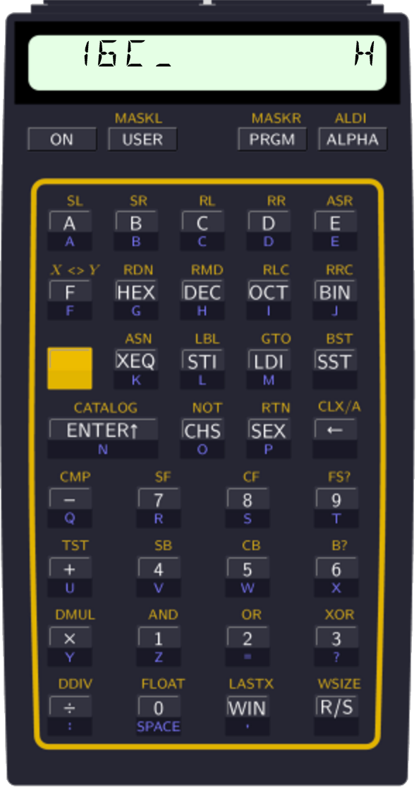

.. index:: keyboard layout

********
Keyboard
********

To make it easy to work with, the Programmer redefines the keyboard of your HP-41 to look as follows.

.. index:: activation

Layout
======

The keyboard layout uses the existing similar functions on keys whenever possible. However, the stack manipulation operations ``RDN`` and ``X<>Y`` are moved to shifted keys as it was judged that digit entry is more important.

The base change keys are ordered in the same way as on the HP-16C and are just after the F digit.

The window key is the dot key. It was selected because the display uses dots to indicate presence of more windows. It is also very close to the 0-3 keys, so you will find the typical argument to use very close to the window activation key.

The bit set, clear and test instructions are located on the row below the corresponding flag operations.

Negation is the same thing as ``CHS``, bitwise ``NOT`` on the same key (shifted) is closely related to negation.

Shift and rotate operations are plentiful. They are arranged together on the upper part of the keyboard.

Double operations are the shifted variant on the corresponding key. However, logical operations such as ``AND``, would also have been a logical alternative here. On the floating point keyboard, these keys shifted serve as compare instructions. A combination of double operations and compare related instructions are now what is found here. ``CMP`` is actually a subtraction, so it is quite at home on that key, as the shifted operation. ``TST`` is related to ``CMP``, so it is next to it.

The logical operations are held together in the usual order you say them, AND, OR, XOR, which also is the alphabetic order.

When you feel that you need to work with floating point numbers, you probably want to use that PI constant, so the ``FLOAT`` operation to switch to floating point mode is on the PI key.

Sign extension is on the ``EEX`` key, which is almost spelled the same.

Activation
==========

Once the Programmer's module has been plugged into your calculator, simply execute the ``INTEGER`` instruction to enable integer mode.

.. index:: deactivation

Deactivation
============

Once activated, the HP-41 stays in integer mode until you execute the ``FLOAT`` instruction. This can be done by pressing the shift key followed by the PI (0 key). It is also possible to execute the ``FLOAT`` instruction using the ``XEQ`` key and as usual.

Another way to disable the Programmer is to turn the calculator off and unplug the module.
