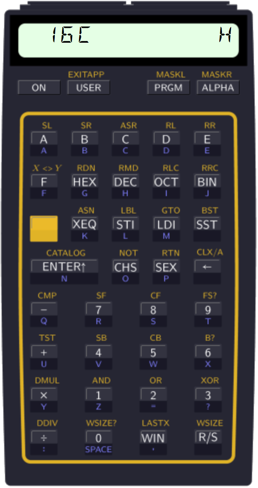

.. index:: keyboard layout

***********
Application
***********

Ladybug makes use of the application shell concept from the OS4 module
to redefine the HP-41 keyboard to be somewhat different compared to
normal, while still retaining essentially all behavior you are used
to. The default display behavior is also changed to display integer
number in the selected base.

.. index:: activation

Activation
==========

Once Ladybug has been plugged into your calculator, simply execute the
``INTEGER`` instruction to enable integer mode.

.. index:: deactivation

Deactivation
============

Once activated, the HP-41 stays in integer mode until you execute the
``EXITAPP`` instruction. This can be done by pressing the shift key
followed by the USER key. It is also possible to execute the
``EXITAPP`` instruction using the ``XEQ`` key and spell it out as
usual.

Another way to disable Ladybug is to turn the calculator off and
unplug the module.
